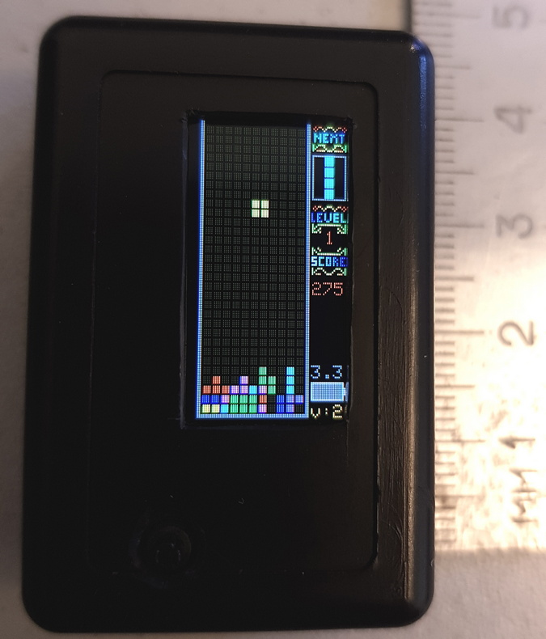
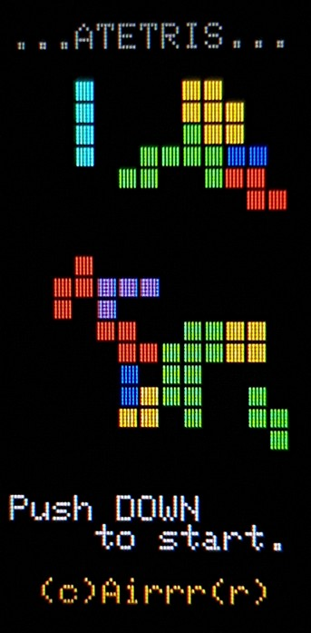
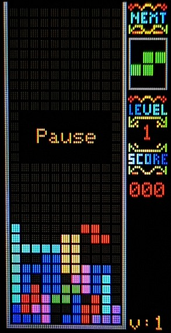
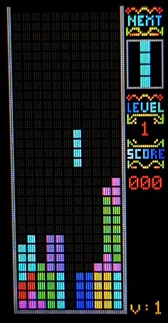
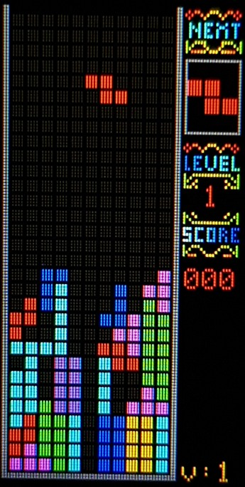
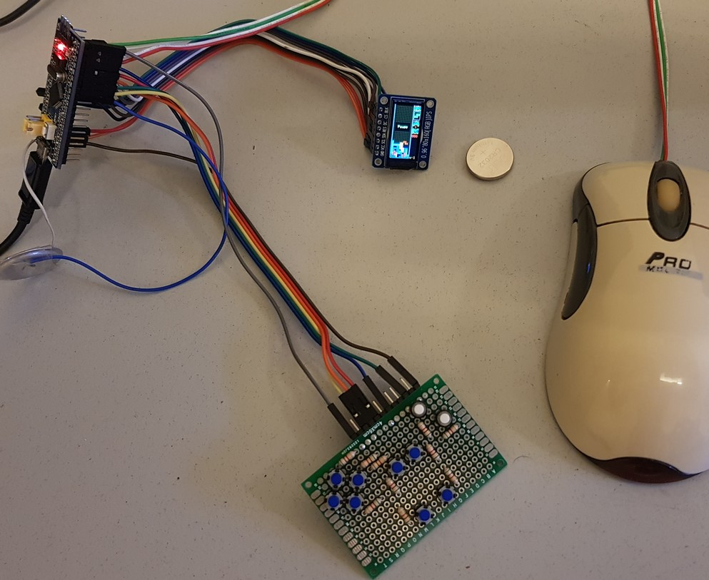

# ATETRIS  
 Arduino Tetris with tiny and colorful ST7735 80x160 and PS2 mouse or keys.  
  
  
  
31x11 Arduino tetris clone. Can be controlled with PS/2 mouse (STM32) or buttons.  
While on pause gamefiled is stored in EEPROM and device turns the screen off and goes  
deep sleep after 10 sec. (You can power off immediately. No need to wait 10s.)  
  
  
  
-STM32 Blue pill or any other with ATmega328 or ATmega32u4  
-ST7735 tiny IPS screen. 80x160. 16bit colors. 0.96" (3.3v!)  
-PS/2 mouse (optional for stm32)  
-5 buttons (optional if no mouse)  
-Piezo beeper (optional)  
  
  
  
  
  
   
  
   
  
  
  
  
Hardware for ATmega:  
2         -Button pause     All keys to ground.  
3         -Button left  
4         -Button right  
5         -Button rotate  
6         -Button down  
A0        -Leave unconnected. Analog random seed.  
7         -Sound. Optional. Piezo to ground.  
  
LCD:  
SCL       - 13 (ATmega328), 15 (ATmega32u4)  
SDA       - 11 (ATmega328), 16 (ATmega32u4)  
RES       - A3  
DC        - A2  
CS        - 10  
BLK       - 8  
  
  
Hardware for STM32:  
PC15        -PS2 mouse data  
PC14        -PS2 mouse clock  
PB9         -Button pause     All keys to ground.  
PB8         -Button left  
PB7         -Button right  
PB6         -Button rotate  
PB5         -Button down  
PA4         -Leave unconnected. Analog random seed.  
PB4         -Sound. Optional. Piezo to ground.  
  
LCD:  
PA5         -SCL  
PA7         -SDA  
PA0         -RES  
PA1         -DC  
PA2         -CS  
PB0         -BLK (optional, saves 20mA)  
  
For STM32:  
In mouse mode buttons also usable.  
Connect 'pause' button for pause.  
To play without mouse start game with pause button pressed (grounded).   
  
  
  
  
Software:  
UPDATE THE User_Setup.h FILE IN THE LIBRARY (TFT_eSPI.h for STM32 and TFT_ST7735 for others)  
  
  
  
  
  
