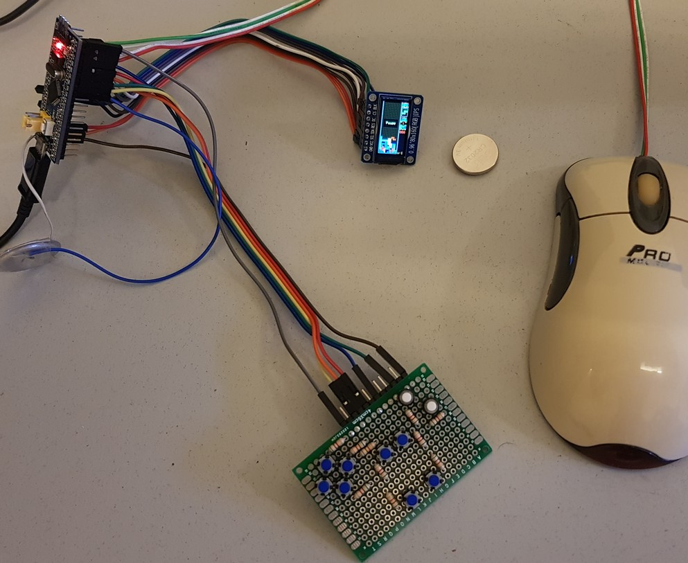
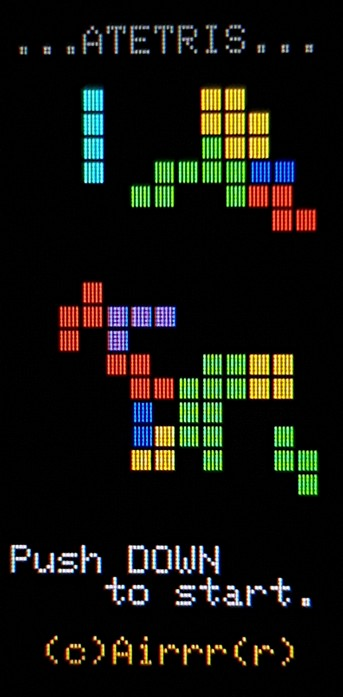
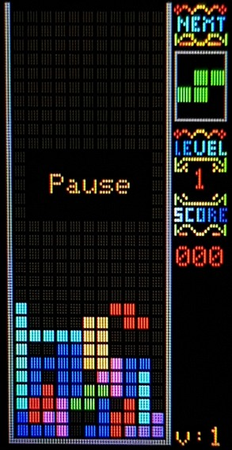
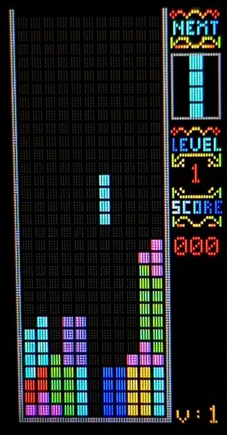
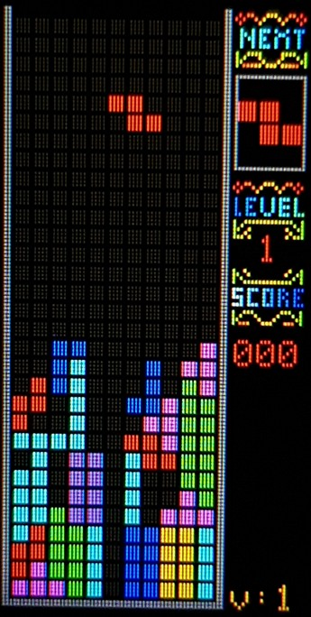

# ATETRIS
 Arduino STM32 Tetris with ST7735 80x160 and PS2 mouse or keys.  
  
  
  
31x11 Arduino tetris clone. Can be controlled with PS/2 mouse or buttons.  
  
Can be played with PS/2 mouse. In this mode buttons also usable.  
Connect 'pause' button for pause.  
To play without mouse start game with pause button pressed (grounded).  
  
-STM32 Blue pill  
-ST7735 tiny IPS screen. 80x160. 16bit colors. 0.96"  
-PS/2 mouse (optional)  
-5 buttons (optional)  
-Piezo beeper (optional)  
  
  
  
  
   
  
   
  
    
Hardware:  
PC15        -PS2 mouse data  
PC14        -PS2 mouse clock  
PB9         -Button pause     All keys to ground.  
PB8         -Button left  
PB7         -Button right  
PB6         -Button rotate  
PB5         -Button down  
PA4         -Leave unconnected. Analog random seed.  
PB4         -Sound. Optional. Piezo to ground.  
  
LCD:  
PA5         -SCL  
PA7         -SDA  
PA0         -RES  
PA1         -DC  
PA2         -CS  
PB0         -BLK (optional, saves 20mA)  
  
  
  
Software:  
UPDATE THE User_Setup.h FILE IN THE LIBRARY  
  
  
  
  
To do:  
-deep sleep after few seconds on LCD off or save to EEPROM.  
  
